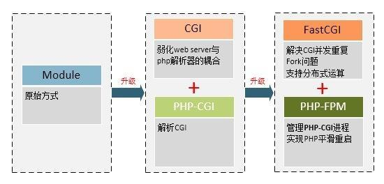
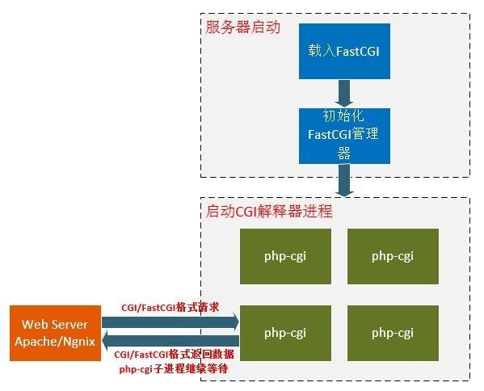
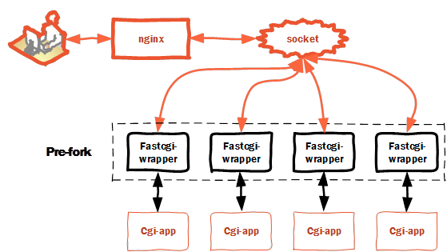

# PHP-FPM

Nginx 和 PHP 通信的主要流程为：通过浏览器访问Url后，请求到web服务器，服务器根据配置文件，确定为PHP脚本文件，转发到PHP解析器，PHP解析器会解析php.ini文件初始化执行环境，然后处理请求，再以标准的数据格式返回处理结果，最后退出进程。

## 通信方式
nginx和php-fpm通信有tcp socket和unix socket两种方式：
- unix socket方式：nginx和php-fpm的进程之间通信，速度快，消耗资源少。而tcp需要经过本地回环驱动，还要申请临时端口和tcp相关资源。

unix socket相比不是那么稳定，当并发连接数爆发时，会产生大量的长时缓存，在没有面向连接协议支撑的情况下，大数据包很有可能就直接出错并不会返回异常。

虽然socket有更少的数据拷贝和上下文切换，更少的资源占用，但是如果数据都是错的，那还有什么用呢。另外使用unix socket的话，必须nginx和fpm在同一台机器上

- tcp socket方式：tcp协议能保证数据的正确性，可以跨服务器，当nginx和php-fpm不在同一台机器上时，只能使用这种方式，但性能不如unix socket。

## CGI
CGI（Common Gateway Interface）是服务器与后台语言交互的协议，有了这个协议，开发者可以使用任何语言处理服务器转发过来的请求，动态地生成内容，保证了传递过来的数据是标准格式的,规定了以什么样的格式传哪些数据（URL、查询字符串、POST数据、HTTP header等等），方便了开发者。

## PHP-CGI
PHP语言对应与服务器交互的CGI程序就是PHP-CGI，标准的CGI程序对每个请求都会执行：PHP解析器解析php.ini文件，初始化执行环境。

CGI程序本身只能解析请求、返回结果，不会进程管理，所以有一个致命的缺点，那就是每处理一个请求都需要fork一个全新的进程，随着Web的兴起，高并发越来越成为常态，这样低效的方式明显不能满足需求，每一次web请求都会有启动和退出进程，也就是最为人诟病的fork-and-execute模式。

## FastCGI
FastCGI，允许在一个进程内处理多个请求，而不是一个请求处理完毕就直接结束进程，性能上有了很大的提高。

FastCGI会先启一个master进程，解析配置文件，初始化执行环境，然后再启动多个worker进程。当请求过来时，master会传递给一个worker，然后立即可以接受下一个请求，避免了重复创建进程。当worker不够用时，master可以根据配置预先启动几个worker等着。当然空闲worker太多时，也会停掉一些，这样就提高了性能，也节约了资源。

## PHP-FPM
PHP-FPM（FastCGI Process Manager）是FastCGI协议的一个实现，任何实现了FastCGI协议的服务器都能够与之通信。

FPM是一个PHP进程管理器，包含master和worker两种进程。

创建master进程后，创建worker pool、监听socket，然后根据配置fork出worker进程。

master与worker不直接通信，master通过共享内存获取worker进程的信息，如worker进程当前状态、已处理请求数等，master要杀死worker进程也是通过发送信号。

worker进程启动后阻塞在`fcgi_accept_request()`，等待accept请求，接收到请求后，读取数据、阻塞执行。

master只负责子进程状态的管理，处理异步信号事件、定时事件等。

[感谢指正](https://github.com/ruesin/php-tree/issues/1)

~~master进程只有一个，负责监听端口，接收来自服务器的请求，而worker进程则一般有多个（具体数量根据实际需要配置），每个进程内部都嵌入了一个PHP解释器，是PHP代码真正执行的地方。~~

~~从FPM接收到请求，到处理完毕，其具体的流程如下：~~
- ~~FPM的master进程接收到请求。~~
- ~~master进程根据配置指派特定的worker进程进行请求处理~~
- ~~如果没有可用进程，返回错误，这也是我们配合Nginx遇到502错误比较多的原因。~~
- ~~worker进程处理请求，如果超时，返回504错误。~~
- ~~请求处理结束，返回结果。~~

## 通信
Nginx不仅仅是一个Web服务器，也是一个功能强大的Proxy服务器，除了进行http请求的代理，也可以进行许多其他协议请求的代理，包括与FPM相关的FastCGI协议。

为了能够使Nginx理解FastCGI协议，Nginx提供了FastCGI模块来将http请求映射为对应的FastCGI请求。

Nginx的FastCGI模块提供了fastcgi_param指令来主要处理这些映射关系，/usr/local/nginx/conf/fastcgi.conf 是Nginx的一个配置文件实例，其主要完成的工作是将Nginx中的变量翻译成PHP中能够理解的变量。

除此之外，非常重要的就是fastcgi_pass指令了，这个指令用于指定FPM进程监听的地址，Nginx会把所有的PHP请求翻译成FastCGI请求之后再发送到这个地址。

