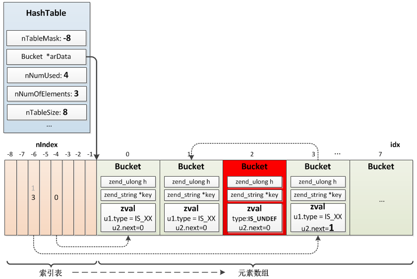
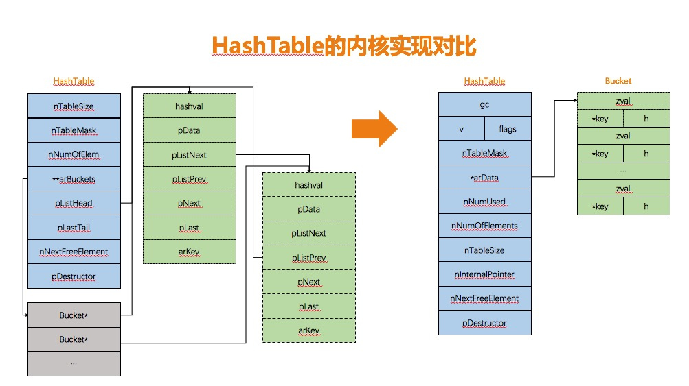
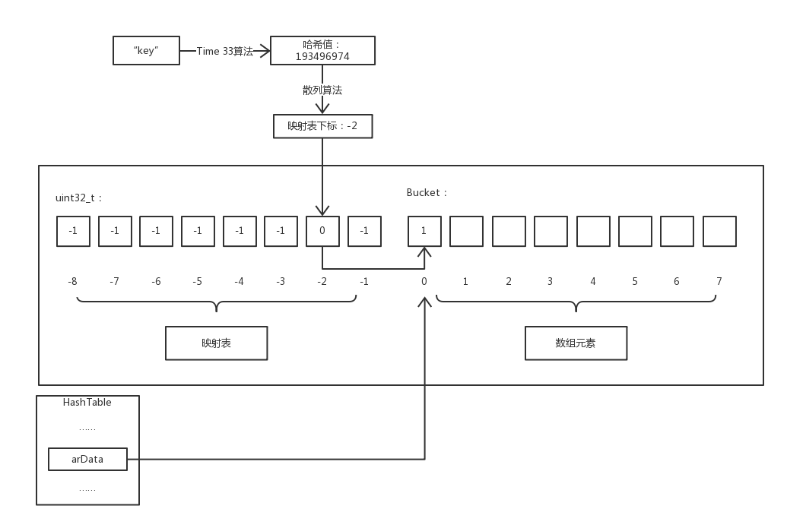
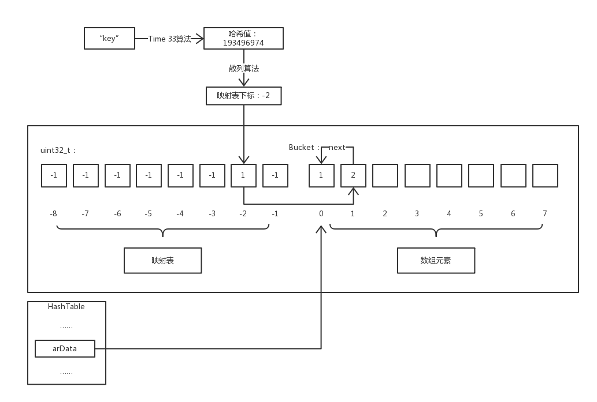

# 数组

数组是PHP中非常强大、灵活的一种数据类型，它的底层实现为散列表(HashTable，也称作：哈希表)，除了我们熟悉的PHP用户空间的Array类型之外，内核中也随处用到散列表，比如函数、类、常量、已include文件的索引表、全局符号表等都用的HashTable存储。

基本上，PHP里面的所有东西都是哈希表，因为哈希表对PHP来说太基础了，因此非常值得深入研究它是如何工作的。

散列表是根据关键码值(Key value)而直接进行访问的数据结构，它的key - value之间存在一个【映射函数】，可以根据key通过映射函数直接索引到对应的value值，它不以关键字的比较为基本操作，采用直接寻址技术（就是说，它是直接通过key映射到内存地址上去的），从而加快查找速度，在理想情况下，无须任何比较就可以找到待查关键字，查找的期望时间为O(1)。

在C里面，数组是内存块，你可以通过下标访问这些内存块。因此，在C里面的数组只能使用整数且有序的键值（那就是说，你不能在键值0之后使用1332423442的键值）。C里面没有关联数组这种东西。

哈希表是这样的东西：它们使用哈希函数转换字符串键值为正常的整型键值。哈希后的结果可以被作为正常的C数组的键值（又名为内存块）。现在的问题是，哈希函数会有冲突，那就是说，多个字符串键值可能会生成一样的哈希值。例如，在PHP，超过64个元素的数组里，字符串”foo”和”oof”拥有一样的哈希值。

这个问题可以通过存储可能冲突的值到链表中，而不是直接将值存储到生成的下标里。

## 结构

存放记录的数组称做散列表，这个数组用来存储value，而value具体在数组中的存储位置由映射函数根据key计算确定，映射函数可以采用取模的方式，key可以通过一些譬如“times 33”的算法得到一个整形值，然后与数组总大小取模得到在散列表中的存储位置。这是一个普通散列表的实现，PHP散列表的实现整体也是这个思路，只是有几个特殊的地方，下面就是PHP中HashTable的数据结构：

```c
//Bucket：散列表中存储的元素
typedef struct _Bucket {
    //存储的具体value，这里嵌入了一个zval，而不是一个指针
    zval              val;
    //key根据times 33计算得到的哈希值，或者是数值索引编号
    zend_ulong        h;                /* hash value (or numeric index)   */
    // 字符键名，数字索引则为 NULL
    zend_string      *key;              /* string key or NULL for numerics */
} Bucket;

//HashTable结构
typedef struct _zend_array HashTable;

struct _zend_array {
    // gc 保存引用计数，内存管理相关
    zend_refcounted_h gc;

    // u 储存辅助信息，哈希表的标记信息，包括类型标志，迭代器计数等
    union {
        struct {
            ZEND_ENDIAN_LOHI_4(
                zend_uchar    flags,
                zend_uchar    nApplyCount, //循环遍历保护
                zend_uchar    nIteratorsCount,
                zend_uchar    consistency)
        } v;
        uint32_t flags;
    } u;

    //哈希值计算掩码，等于nTableSize的负值(nTableMask = -nTableSize)，用于散列函数的快速定位
    uint32_t          nTableMask; 
    //arData 指向储存元素的数组第一个 Bucket，Bucket 为统一的数组元素类型，指向了哈希表中元素的实际存储位置
    Bucket           *arData;
    //已用Bucket数
    uint32_t          nNumUsed;
    //哈希表实际有效元素数
    uint32_t          nNumOfElements;
    //哈希表总大小，Hash值的区间，为2的n次方
    uint32_t          nTableSize;
    // 内部位置指针，提供给迭代器使用，默认用于标注第一个有效的元素在Bucket数组中的位置，会被reset, current这些遍历函数使用
    uint32_t          nInternalPointer;
    //下一个空闲可用位置的数值索引,如:arr[] = 1;arr["a"] = 2;arr[] = 3; 则nNextFreeElement = 2;
    zend_long         nNextFreeElement;
    dtor_func_t       pDestructor; //元素的析构函数(指针)
};

```

### nNumUsed & nNumOfElements

`nNumUsed`指的是`arData`数组中已使用的`Bucket`数，`nNumOfElements`对应的是数组中有效可用的元素个数，也是函数`count($array)`返回的值。所以`nNumUsed>=nNumOfElements`。

当将一个元素从哈希表删除时并不会立即将对应的Bucket移除，而是将Bucket存储的zval的类型修改为IS_UNDEF，每次删除元素都要将数组移动并重新索引太浪费时间。只有扩容时发现nNumOfElements与nNumUsed相差达到一定数量(这个数量是:ht->nNumUsed - ht->nNumOfElements > (ht->nNumOfElements >> 5))时才会将已删除的元素全部移除，重新构建哈希表。

### nTableSize
`nTableSize`是数组(哈希表)的容量，是下一个大于等于`nNumOfElements`的2的幂次方。PHP 的数组是不定长度但 C 语言的数组定长的，为了实现 PHP 的不定长数组的功能，采用了「扩容」的机制，就是在每次插入元素的时候判断 nTableSize 是否足以储存。如果不足则重新申请 2 倍 nTableSize 大小的新数组，并将原数组复制过来（此时正是清除原数组中类型为 IS_UNDEF 元素的时机）并且重新索引。

如果数组存储了32元素，那么哈希表也是32大小的容量。但如果再多一个元素添加进来，也就是说，数组现在有33个元素，那么哈希表的容量就被调整为64。

如果哈希表太小，那么将会有很多的冲突，而且性能也会降低。另一方面，如果哈希表太大，那么浪费内存。2的幂值是一个很好的折中方案。

### nTableMask
`nTableMask`是哈希表的容量减一。这个mask用来根据当前的表大小调整生成的哈希值。例如，”foo”真正的哈希值（使用DJBX33A哈希函数）是193491849。如果我们现在有64容量的哈希表，我们明显不能使用它作为数组的下标。取而代之的是通过应用哈希表的mask，然后只取哈希表的低位。

```
hash           |        193491849 |     0b1011100010000111001110001001
& mask         | &             63 | &   0b0000000000000000000000111111
---------------------------------------------------------
= index        | = 9              | =   0b0000000000000000000000001001
```

### nNextFreeElement
`nNextFreeElement`保存下一个可用数字索引，例如在 PHP 中 $a[] = 1; 这种用法将插入一个索引为 nNextFreeElement 的元素，然后 nNextFreeElement 自增 1。

### nInternalPointer
存储数组当前的位置。这个值在foreach遍历时可使用reset()，current()，key()，next()，prev()和end()函数访问。

### arData
`arData`，这个值指向存储元素数组的第一个Bucket，插入元素时按顺序依次插入数组，比如第一个元素在arData[0]、第二个在arData[1]...arData[nNumUsed]。PHP数组的有序性正是通过arData保证的，这是第一个与普通散列表实现不同的地方。

既然`arData`并不是按key映射的散列表，那么映射函数是如何将key与arData中的value建立映射关系的呢？

实际上这个散列表（映射表）也在`arData`中，比较特别的是散列表在`ht->arData`内存之前，分配内存时这个散列表与Bucket数组一起分配，`arData`向后移动到了Bucket数组的起始位置，并不是申请内存的起始位置，这样散列表可以由`arData`指针向前移动访问到，即arData[-1]、arData[-2]、arData[-3]......散列表的结构是uint32_t，它保存的是value在Bucket数组中的位置。

所以，整体来看HashTable主要依赖arData实现元素的存储、索引。插入一个元素时先将元素按先后顺序插入Bucket数组，位置是idx，再根据key的哈希值映射到散列表中的某个位置nIndex，将idx存入这个位置；查找时先在散列表中映射到nIndex，得到value在Bucket数组的位置idx，再从Bucket数组中取出元素。

比如：
```php
$arr["a"] = 1;
$arr["b"] = 2;
$arr["c"] = 3;
$arr["d"] = 4;

unset($arr["c"]);
```

对应的HashTable：


> 图中Bucket的zval.u2.next默认值应该为-1，不是0

## PHP5
与PHP5不同的是，HashTable的数据结构发生的巨大的变化，取消了原有按key映射双向链表的模式，而采用一维数组统一管理。



优点：
- 加速寻值定位，直接利用hash值计算得到索引，在一维数组上通过指针运算定位元素，效率更高。
- 数组的结构形式能够很好的利用cpu cache的性能，减少cpu cache命中失败的次数。[cpu cache](http://cenalulu.github.io/linux/all-about-cpu-cache/)
- 简化Bucket的管理，不需要双向链表维持插入顺序，利用数组的天然优势，减少了Bucket结构的冗余信息，指针内存以及分配操作。

## 数组访问

与一般哈希表不同的是 PHP 数组的哈希表实现了元素的有序性，就是插入的元素从内存上来看是连续的而不是乱序的，为了实现这个有序性 PHP 采用了「映射表」技术。



映射表和数组元素在同一片连续的内存中，映射表是一个长度与存储元素相同的整型数组，它默认值为 -1 ，有效值为 Bucket 数组的下标。而 HashTable->arData 指向的是这片内存中 Bucket 数组的第一个元素。

举个例子 $a['key'] 访问数组 $a 中键名为 key 的成员，流程介绍：首先通过 Time 33 算法计算出 key 的哈希值，然后通过散列算法计算出该哈希值对应的映射表下标，因为映射表中保存的值就是 Bucket 数组中的下标值，所以就能获取到 Bucket 数组中对应的元素。

## 映射函数
映射函数(即：散列函数)是散列表的关键部分，是通过键名的哈希值映射到「映射表」的下标的算法，它将key与value建立映射关系，一般映射函数可以根据key的哈希值与Bucket数组大小取模得到，即`key->h % ht->nTableSize`，但是PHP却不是这么做的：

```c
nIndex = key->h | ht->nTableMask;
```

按位或的位运算要比取模更快。

将哈希值和 nTableMask 进行或运算即可得出映射表的下标，其中 nTableMask 数值为 nTableSize 的负数，即:nTableMask = -nTableSize。由于  nTableSize 的值为 2 的幂次方，所以 h | ht->nTableMask 的取值范围在 [-nTableSize, -1] 之间，所以nTableMask二进制位右侧全部为0，也就保证了nIndex落在数组索引的范围之内(|nIndex| <= nTableSize)：
```
11111111 11111111 11111111 11111000   -8
11111111 11111111 11111111 11110000   -16
11111111 11111111 11111111 11100000   -32
11111111 11111111 11111111 11000000   -64
11111111 11111111 11111111 10000000   -128
```

## 哈希碰撞
不同的key可能计算得到相同的哈希值(数值索引的哈希值直接就是数值本身)，但是这些值又需要插入同一个散列表。一般解决方法是将Bucket串成链表，查找时遍历链表比较key。

PHP的实现也是如此，只是将链表的指针指向转化为了数值指向，即：指向冲突元素的指针并没有直接存在Bucket中，而是保存到了value的zval中：

```c
struct _zval_struct {
    zend_value        value;            /* value */
    ...
    union {
        uint32_t     var_flags;
        uint32_t     next;                 /* hash collision chain */
        uint32_t     cache_slot;           /* literal cache slot */
        uint32_t     lineno;               /* line number (for ast nodes) */
        uint32_t     num_args;             /* arguments number for EX(This) */
        uint32_t     fe_pos;               /* foreach position */
        uint32_t     fe_iter_idx;          /* foreach iterator index */
    } u2;
};
```

当出现冲突时将原value的位置保存到新value的zval.u2.next中，然后将新插入的value的位置更新到散列表，也就是后面冲突的value始终插入header。所以查找过程类似：

```c
zend_ulong h = zend_string_hash_val(key);
uint32_t idx = ht->arHash[h & ht->nTableMask];
while (idx != INVALID_IDX) {
    Bucket *b = &ht->arData[idx];
    if (b->h == h && zend_string_equals(b->key, key)) {
        return b;
    }
    idx = Z_NEXT(b->val); //移到下一个冲突的value
}
return NULL;
```



访问冲突时的过程，假设要访问`$a['key']`。首先通过散列运算得出映射表下标为`-2`，然后访问映射表发现其内容指向`arData`数组下标为 1 的元素。此时我们将该元素的`key`和要访问的键名相比较，发现两者并不相等，则该元素并非我们所想访问的元素，而元素的 val.u2.next 保存的值正是下一个具有相同散列值的元素对应`arData`数组的下标，所以我们可以不断通过 next 的值遍历直到找到键名相同的元素或查找失败。

## 数组初始化
常见哈希表操作(包括外部接口与内部调整)的具体实现方式。PHP7的哈希表实现针对不同的操作场景提供了不同的操作接口，比如数值key插入，字符串key插入等，根据语法分析过程生产的opcode和操作数的不同，在`zend_vm_execute`的入口函数中会调用不同的哈希表接口处理。

初始化的操作主要完成了`Bucket`首地址`arData`的设置与散列表的初始赋值。

取Bucket头指针的宏定义，可见分配内存时，申请了物理上连续，逻辑上分开的两段内存，即散列表与Bucket数组。

```c
//zend_hash.c
static zend_always_inline void zend_hash_real_init_ex(HashTable *ht, int packed)
{
    HT_ASSERT_RC1(ht);
    ZEND_ASSERT(!((ht)->u.flags & HASH_FLAG_INITIALIZED));
    if (packed) { //压缩数组，针对hash key为完美连续自然数的场景优化，参考https://phpinternals.net/docs/hash_flag_packed
        HT_SET_DATA_ADDR(ht, pemalloc(HT_SIZE(ht), (ht)->u.flags & HASH_FLAG_PERSISTENT)); //分配Bucket数组及散列表
        (ht)->u.flags |= HASH_FLAG_INITIALIZED | HASH_FLAG_PACKED;
        HT_HASH_RESET_PACKED(ht); //压缩数组直接使用整数key作为hash索引，进一步减少了定位开销，所以也就不要前置的散列表
    } else {
        (ht)->nTableMask = -(ht)->nTableSize;
        HT_SET_DATA_ADDR(ht, pemalloc(HT_SIZE(ht), (ht)->u.flags & HASH_FLAG_PERSISTENT));
        (ht)->u.flags |= HASH_FLAG_INITIALIZED;
        if (EXPECTED(ht->nTableMask == (uint32_t)-8)) { //初始化散列表
            Bucket *arData = ht->arData;

            HT_HASH_EX(arData, -8) = -1;
            HT_HASH_EX(arData, -7) = -1;
            HT_HASH_EX(arData, -6) = -1;
            HT_HASH_EX(arData, -5) = -1;
            HT_HASH_EX(arData, -4) = -1;
            HT_HASH_EX(arData, -3) = -1;
            HT_HASH_EX(arData, -2) = -1;
            HT_HASH_EX(arData, -1) = -1;
        } else {
            HT_HASH_RESET(ht);
        }
    }
}

//取nTableMask的负数
#define HT_HASH_SIZE(nTableMask) \
    (((size_t)(uint32_t)-(int32_t)(nTableMask)) * sizeof(uint32_t))

#define HT_SET_DATA_ADDR(ht, ptr) do { \
        (ht)->arData = (Bucket*)(((char*)(ptr)) + HT_HASH_SIZE((ht)->nTableMask)); \
    } while (0)
```

## 插入元素

针对插入过程，除去一些初始化检查，压缩数组类型变化及是否需要扩容check操作，比较核心的是goto标记add_to_hash位置开始的内容：

首先按照插入顺序，放入Buckdet数组下一个可以位置，哈希表计数更新。以此位置为索引，填充传入的value。当发生碰撞，采用头插法，(zval).u2.next记录下一个相同散列值元素的位置。最后更新散列表中的索引值。

```c
//zend_hash.c
static zend_always_inline zval *_zend_hash_add_or_update_i(HashTable *ht, zend_string *key, zval *pData, uint32_t flag ZEND_FILE_LINE_DC)
{
    zend_ulong h;
    uint32_t nIndex;
    uint32_t idx;
    Bucket *p;

    IS_CONSISTENT(ht);
    HT_ASSERT_RC1(ht);

    // 数组未初始化
    if (UNEXPECTED(!(ht->u.flags & HASH_FLAG_INITIALIZED))) {
        // 初始化数组
        CHECK_INIT(ht, 0);
        // 跳转至插入元素段
        goto add_to_hash;
    } else if (ht->u.flags & HASH_FLAG_PACKED) { // 数组为连续数字索引数组
        // 转换为关联数组 转换为非自然序的形式，重构散列表
        zend_hash_packed_to_hash(ht);
    } else if ((flag & HASH_ADD_NEW) == 0) { // 添加新元素
        //按key查找键名对应的元素
        p = zend_hash_find_bucket(ht, key);
        
        //如果相同键名元素存在，即如果找到了数据，就detroy掉老数据，然后用传入的data覆盖掉旧数据
        if (p) {
            zval *data;

            /* 内部 _zend_hash_add API 的逻辑，可以忽略 */
            if (flag & HASH_ADD) {// 指定 add 操作
                
                // 若不允许更新间接类型变量则直接返回
                if (!(flag & HASH_UPDATE_INDIRECT)) {
                    return NULL;
                }
                // 确定当前值和新值不同
                ZEND_ASSERT(&p->val != pData);
                // data 指向原数组成员值
                data = &p->val;
                // 原数组元素变量类型为间接类型
                if (Z_TYPE_P(data) == IS_INDIRECT) {
                    // 取间接变量对应的变量
                    data = Z_INDIRECT_P(data);
                    if (Z_TYPE_P(data) != IS_UNDEF) {
                        return NULL;
                    }
                } else {// 非间接类型直接返回
                    return NULL;
                }
            /* 一般 PHP 数组更新逻辑 */
            } else {// 没有指定 add 操作
                // 确定当前值和新值不同
                ZEND_ASSERT(&p->val != pData);
                // data 指向原数组元素值
                data = &p->val;
                // 允许更新间接类型变量则 data 指向对应的变量
                if ((flag & HASH_UPDATE_INDIRECT) && Z_TYPE_P(data) == IS_INDIRECT) {
                    data = Z_INDIRECT_P(data);
                }
            }
            // 析构函数存在
            if (ht->pDestructor) {
                // 执行析构函数
                ht->pDestructor(data);
            }
            // 将 pData 的值复制给 data
            ZVAL_COPY_VALUE(data, pData);
            return data;
        }
    }
    // 如果哈希表已满，则进行扩容
    ZEND_HASH_IF_FULL_DO_RESIZE(ht);        /* If the Hash table is full, resize it */

add_to_hash:
    // 数组已使用 Bucket 数 +1，获取存储位置，idx
    idx = ht->nNumUsed++;
    // 数组有效元素数目 +1
    ht->nNumOfElements++;
    // 若内部指针无效则指向当前下标
    if (ht->nInternalPointer == HT_INVALID_IDX) {
        ht->nInternalPointer = idx; //首次插入，更新nInternalPointer
    }
    zend_hash_iterators_update(ht, HT_INVALID_IDX, idx);
    // p 为新元素对应的 Bucket
    p = ht->arData + idx;
    // 设置键名
    p->key = key;
    if (!ZSTR_IS_INTERNED(key)) {
        zend_string_addref(key); //为key添加引用计数
        ht->u.flags &= ~HASH_FLAG_STATIC_KEYS; //非内部key
        zend_string_hash_val(key); //计算key的hash值 time 33算法
    }
    // 计算键名的哈希值并赋值给 p
    p->h = h = ZSTR_H(key);
    // 将 pData 赋值该 Bucket 的 val，value赋值
    ZVAL_COPY_VALUE(&p->val, pData);
    // 计算映射表下标，计算idx在散列表的位置
    nIndex = h | ht->nTableMask;
    // 解决冲突，将原映射表中的内容赋值给新元素变量值的 u2.next 成员 //拉链，指向当前散列表上标记的元素 #define Z_NEXT(zval)    (zval).u2.next
    Z_NEXT(p->val) = HT_HASH(ht, nIndex);
    // 将映射表中的值设为 idx //更新散列表元素值
    HT_HASH(ht, nIndex) = HT_IDX_TO_HASH(idx);

    return &p->val;
}
```

## 扩容

散列表可存储的value数是固定的，当空间不够用时就要进行扩容了。

PHP散列表的大小为2^n，插入时如果容量不够则首先检查已删除元素所占比例，如果达到阈值(ht->nNumUsed - ht->nNumOfElements > (ht->nNumOfElements >> 5)，则将已删除元素移除，重建索引，如果未到阈值则进行扩容操作，扩大为当前大小的2倍，将当前Bucket数组复制到新的空间，然后重建索引。

在插入元素的代码里有这样一个宏`ZEND_HASH_IF_FULL_DO_RESIZE`，这个宏其实就是调用了`zend_hash_do_resize`函数，对数组进行扩容并重新索引。

扩容主要经过：double size、alloc memory、rehash三步。

`zend_hash.c`：
```c
static void ZEND_FASTCALL zend_hash_do_resize(HashTable *ht)
{

    IS_CONSISTENT(ht);
    HT_ASSERT_RC1(ht);

    // IS_UNDEF 元素超过 Bucket 数组的 1/33
    if (ht->nNumUsed > ht->nNumOfElements + (ht->nNumOfElements >> 5)) { /* additional term is there to amortize the cost of compaction */
        zend_hash_rehash(ht);//重建索引数组
    } else if (ht->nTableSize < HT_MAX_SIZE) {    /* Let's double the table size */
        // 数组大小 < 最大限制，进行扩容 
        //获取索引数组的头指针
        void *new_data, *old_data = HT_GET_DATA_ADDR(ht);
        //扩大为2倍，加法要比乘法快
        uint32_t nSize = ht->nTableSize + ht->nTableSize;
        Bucket *old_buckets = ht->arData;

        //申请新分配arData空间，大小为:(sizeof(Bucket) + sizeof(uint32_t)) * nSize
        new_data = pemalloc(HT_SIZE_EX(nSize, -nSize), ht->u.flags & HASH_FLAG_PERSISTENT);
        // 更新数组结构体成员值
        ht->nTableSize = nSize;
        ht->nTableMask = -ht->nTableSize;
        //重置Bucket首指针，将arData指针偏移到Bucket数组起始位置
        HT_SET_DATA_ADDR(ht, new_data);
        //由于Bucket数组按照插入顺序放置元素，直接将旧的Bucket数组拷到新空间
        memcpy(ht->arData, old_buckets, sizeof(Bucket) * ht->nNumUsed);
        //释放旧空间
        pefree(old_data, ht->u.flags & HASH_FLAG_PERSISTENT);
        //重建索引数组：散列表
        zend_hash_rehash(ht);
    } else {
        // 数组大小超出内存限制
        zend_error_noreturn(E_ERROR, "Possible integer overflow in memory allocation (%u * %zu + %zu)", ht->nTableSize * 2, sizeof(Bucket) + sizeof(uint32_t), sizeof(Bucket));
    }
}

#define HT_SET_DATA_ADDR(ht, ptr) do { \
        (ht)->arData = (Bucket*)(((char*)(ptr)) + HT_HASH_SIZE((ht)->nTableMask)); \
    } while (0)
    
```

## 重建散列表
当删除元素达到一定数量或扩容后都需要重建散列表，因为value在Bucket位置移动了或哈希数组nTableSize变化了导致key与value的映射关系改变，重建过程实际就是遍历Bucket数组中的value，然后重新计算映射值更新到散列表，除了更新散列表之外，这里还有一个重要的处理：移除已删除的value，操作的方式也比较简单：将后面未删除的value依次前移。

rehash首先重置散列表到初始状态，如果当前哈希表内没有被标记为UNDEF的value，那么从Bucket数组的首地址开始遍历，重新设置散列表，并执行头插。

如果哈希表里有标记为UNDEF的value，则在遍历的过程中，忽略掉UNDEF的value，并使用下一个有效的value，覆盖当前UNDEF的value，同时完成散列表的更新和碰撞拉链。

如果当前哈希表有关联的迭代器，还需要把迭代器里的position更新为新的索引值。

```c
//zend_hash.c
ZEND_API int ZEND_FASTCALL zend_hash_rehash(HashTable *ht)
{
    Bucket *p;
    uint32_t nIndex, i;

    IS_CONSISTENT(ht);
    // 数组为空
    if (UNEXPECTED(ht->nNumOfElements == 0)) {
        if (ht->u.flags & HASH_FLAG_INITIALIZED) { // 已初始化
            ht->nNumUsed = 0; // 已使用 Bucket 数置 0
            HT_HASH_RESET(ht); // 映射表重置
        }
        return SUCCESS; // 返回成功
    }

    // 映射表重置，重置所有索引数组值为-1
    HT_HASH_RESET(ht);
    i = 0;
    p = ht->arData;
    // Bucket 数组全部为有效值，没有 IS_UNDEF
    if (HT_IS_WITHOUT_HOLES(ht)) {
        // Bucket数组，重新设置映射表的值，计算索引值，并填充索引数组
        do {
            nIndex = p->h | ht->nTableMask;
            Z_NEXT(p->val) = HT_HASH(ht, nIndex);
            HT_HASH(ht, nIndex) = HT_IDX_TO_HASH(i);
            p++;
        } while (++i < ht->nNumUsed);
    } else {
        do {
            // 当前 Bucket 类型为 IS_UNDEF
            if (UNEXPECTED(Z_TYPE(p->val) == IS_UNDEF)) {
                uint32_t j = i;
                Bucket *q = p;

                if (EXPECTED(ht->u.v.nIteratorsCount == 0)) { //没有迭代器在使用
                    // 移动数组覆盖 IS_UNDEF 元素
                    // 有效的数据重新拷贝到前一个位置，并重置索引，无效的跳过，被后面的有效值覆盖掉
                    while (++i < ht->nNumUsed) {
                        p++;
                        if (EXPECTED(Z_TYPE_INFO(p->val) != IS_UNDEF)) {
                            ZVAL_COPY_VALUE(&q->val, &p->val);
                            q->h = p->h;
                            nIndex = q->h | ht->nTableMask;
                            q->key = p->key;
                            Z_NEXT(q->val) = HT_HASH(ht, nIndex);
                            HT_HASH(ht, nIndex) = HT_IDX_TO_HASH(j);
                            if (UNEXPECTED(ht->nInternalPointer == i)) {
                                ht->nInternalPointer = j;
                            }
                            q++;
                            j++;
                        }
                    }
                } else {
                    uint32_t iter_pos = zend_hash_iterators_lower_pos(ht, 0);
                    // 移动数组覆盖 IS_UNDEF 元素
                    while (++i < ht->nNumUsed) {
                        p++;
                        if (EXPECTED(Z_TYPE_INFO(p->val) != IS_UNDEF)) {
                            ZVAL_COPY_VALUE(&q->val, &p->val);
                            q->h = p->h;
                            nIndex = q->h | ht->nTableMask;
                            q->key = p->key;
                            Z_NEXT(q->val) = HT_HASH(ht, nIndex);
                            HT_HASH(ht, nIndex) = HT_IDX_TO_HASH(j);
                            if (UNEXPECTED(ht->nInternalPointer == i)) {
                                ht->nInternalPointer = j;
                            }
                            //更新迭代器的信息
                            if (UNEXPECTED(i == iter_pos)) {
                                zend_hash_iterators_update(ht, i, j);
                                iter_pos = zend_hash_iterators_lower_pos(ht, iter_pos + 1);
                            }
                            q++;
                            j++;
                        }
                    }
                }
                ht->nNumUsed = j;
                break;
            }
            nIndex = p->h | ht->nTableMask;
            Z_NEXT(p->val) = HT_HASH(ht, nIndex);
            HT_HASH(ht, nIndex) = HT_IDX_TO_HASH(i);
            p++;
        } while (++i < ht->nNumUsed);
    }
    return SUCCESS;
}
```

## 查找
哈希表的查找过程：locate bucket、search for collision chain、compare key and return value

```c
//zend_hash.c
static zend_always_inline Bucket *zend_hash_find_bucket(const HashTable *ht, zend_string *key)
{
    zend_ulong h;
    uint32_t nIndex;
    uint32_t idx;
    Bucket *p, *arData;

    h = zend_string_hash_val(key);
    arData = ht->arData;
    nIndex = h | ht->nTableMask;
    idx = HT_HASH_EX(arData, nIndex); //计算Bucket数组中的idx
    while (EXPECTED(idx != HT_INVALID_IDX)) {
        p = HT_HASH_TO_BUCKET_EX(arData, idx);
        //key的内存地址一样
        if (EXPECTED(p->key == key)) { /* check for the same interned string */
            return p;
        } else if (EXPECTED(p->h == h) &&
             EXPECTED(p->key) &&
             EXPECTED(ZSTR_LEN(p->key) == ZSTR_LEN(key)) &&
             ////key的内容一样
             EXPECTED(memcmp(ZSTR_VAL(p->key), ZSTR_VAL(key), ZSTR_LEN(key)) == 0)) {
            return p;
        }
        idx = Z_NEXT(p->val);
    }
    return NULL;
}
```

## 删除

在执行元素的删除时，首先按照hash find的方式，查找的目标key所在的Bucket，因为涉及到collision chain的调整，所以还需要标记一下当前节点的前驱节点。

真正在执行元素删除时，如果有前驱节点，则把前驱节点的后继指向下一个节点，否则直接更新散列表的值为后继节点的位置。

如果发现删除的元素是Bucket数组中的最后一个元素，此时会在Bucket数组中回溯，忽略掉UNDEF的value。相当于执行一次已删除元素的清理。

如果删除的是nInterPointer位置的元素，还需要更新一下这个值，指向第一个非UNDEF的元素位置，为foreach的起点，保证foreach的正确性。

最后如果设置的destructor则执行对于的销毁操作，并把当前的value置为UNDEF。

```c
//zend_hash.c
ZEND_API int ZEND_FASTCALL zend_hash_del(HashTable *ht, zend_string *key)
{
	zend_ulong h;
	uint32_t nIndex;
	uint32_t idx;
	Bucket *p;
	Bucket *prev = NULL;

	IS_CONSISTENT(ht);
	HT_ASSERT_RC1(ht);

	h = zend_string_hash_val(key);
	nIndex = h | ht->nTableMask;

	idx = HT_HASH(ht, nIndex);
	while (idx != HT_INVALID_IDX) {
		p = HT_HASH_TO_BUCKET(ht, idx);
		if ((p->key == key) ||
			(p->h == h &&
		     p->key &&
		     ZSTR_LEN(p->key) == ZSTR_LEN(key) &&
		     memcmp(ZSTR_VAL(p->key), ZSTR_VAL(key), ZSTR_LEN(key)) == 0)) { //找到当前元素，并标记前驱节点
			_zend_hash_del_el_ex(ht, idx, p, prev);
			return SUCCESS;
		}
		prev = p;
		idx = Z_NEXT(p->val);
	}
	return FAILURE;
}

static zend_always_inline void _zend_hash_del_el_ex(HashTable *ht, uint32_t idx, Bucket *p, Bucket *prev)
{
    if (!(ht->u.flags & HASH_FLAG_PACKED)) { //非压缩数组
        if (prev) { //有前驱节点，前驱节点的后继指向当前节点的后继
            Z_NEXT(prev->val) = Z_NEXT(p->val);
        } else { //否则，更新散列表中的值为后继节点的idx
            HT_HASH(ht, p->h | ht->nTableMask) = Z_NEXT(p->val);
        }
    }
    if (HT_IDX_TO_HASH(ht->nNumUsed - 1) == idx) {
        //如果删除的是Bucket数组中最后一个填充的元素，循环往前忽略掉UNDEF的Bucket
        do {
            ht->nNumUsed--;
        } while (ht->nNumUsed > 0 && (UNEXPECTED(Z_TYPE(ht->arData[ht->nNumUsed-1].val) == IS_UNDEF)));
    }
    ht->nNumOfElements--;
    if (HT_IDX_TO_HASH(ht->nInternalPointer) == idx || UNEXPECTED(ht->u.v.nIteratorsCount)) {
        uint32_t new_idx; //删除的是nInternalPointer位置的元素

        new_idx = idx = HT_HASH_TO_IDX(idx);
        while (1) {
            new_idx++;
            if (new_idx >= ht->nNumUsed) {
                new_idx = HT_INVALID_IDX;
                break;
            } else if (Z_TYPE(ht->arData[new_idx].val) != IS_UNDEF) { //找到第一个非UNDEF的元素为foreach的起点
                break;
            }
        }
        if (ht->nInternalPointer == idx) {
            ht->nInternalPointer = new_idx;
        }
        zend_hash_iterators_update(ht, idx, new_idx); //更新迭代器的位置
    }
    if (p->key) {
        zend_string_release(p->key); //释放key
    }
    if (ht->pDestructor) { //当前的value设为undef，如果Destructor不为空，destory掉老的value
        zval tmp;
        ZVAL_COPY_VALUE(&tmp, &p->val);
        ZVAL_UNDEF(&p->val);
        ht->pDestructor(&tmp);
    } else {
        ZVAL_UNDEF(&p->val);
    }
}
```


参考：
- https://github.com/pangudashu/php7-internal/blob/master/2/zend_ht.md
- https://www.0php.net/posts/PHP-%E6%95%B0%E7%BB%84%E5%BA%95%E5%B1%82%E5%AE%9E%E7%8E%B0.html
- https://gsmtoday.github.io/2018/03/21/php-hashtable/
- https://www.hoohack.me/2016/02/15/understanding-phps-internal-array-implementation-ch

未参考：
- http://www.nowamagic.net/librarys/veda/detail/1458
- https://blog.csdn.net/a600423444/article/details/7073854
- http://www.laruence.com/2009/08/23/1065.html